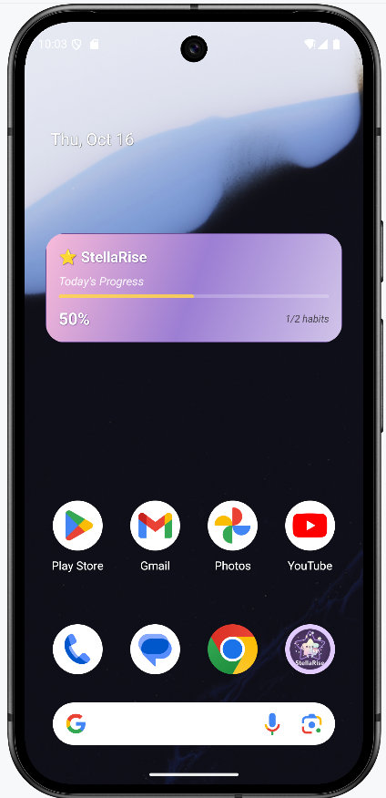
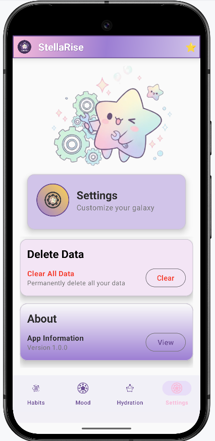

# StellaRise - Android Habit Tracking App

An anime star themed Android wellness app for habit tracking, mood journaling, and hydration

## Features
 
Habit Tracker- Daily habits with completion guides and a star rating system

Mood Journal– Emoji-based mood logging with trend visualization

Hydration Tracker - Star-shaped bottle view that fills based on your daily goal with reminder

Home Screen Widget - Quick-glance habit completion percentage

Push Notifications- Hydration reminders with configurable intervals

Settings Panel - Customize goals, notifications, and reset data

## Tech Stack

 Kotlin

Android SDK (minSdk 24/targetSdk 34)

Material Design 3

ViewPager2 + Fragment navigation

WorkManager (background task scheduling)

AlarmManager (hydration reminder notifications)

AppWidgetProvider (home screen widget)

ViewModel + LiveData (lifecycle-aware UI)

SharedPreferences + Gson (local data storage)

Custom Views –`StarBottleView`,`SimpleMoodChart`,`SimpleLineChart`(drawn with Canvas API)

## Screenshots

  

  

  

  

  

  

  

  

  

  

  

